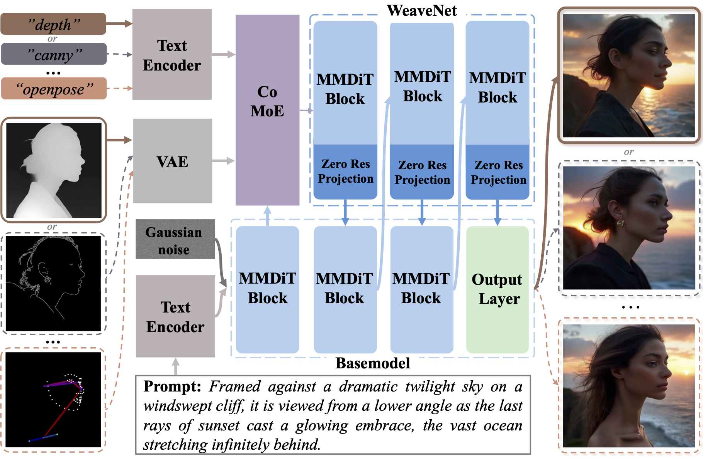
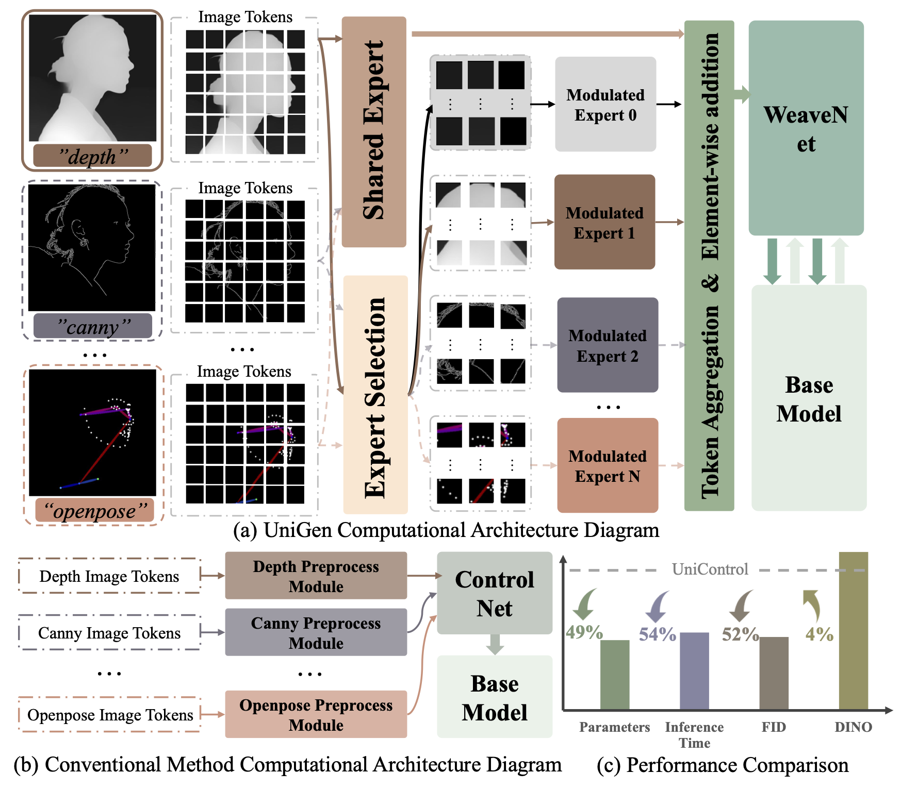
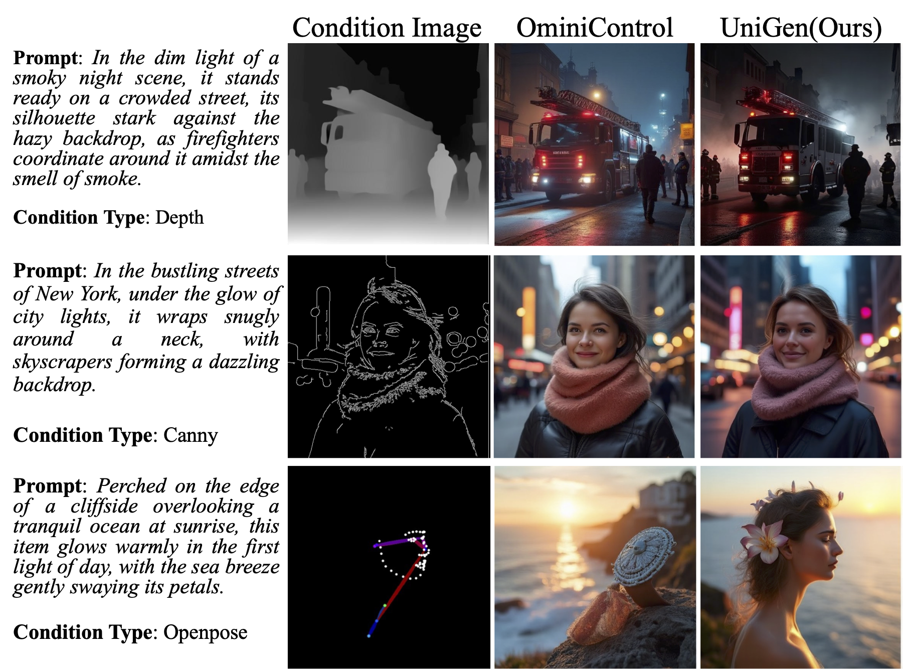

<h1 align="center"> <href src="https://arxiv.org/pdf/2508.17364">Condition Weaving Meets Expert Modulation: Towards Universal and Controllable Image Generation (UniGen) </h1>


> **[Condition Weaving Meets Expert Modulation: Towards Universal and Controllable Image Generation](https://arxiv.org/pdf/2508.17364)** \
> Guoqing Zhang <sup>1,3</sup>, Xingtong Ge<sup>2,3</sup>, Lu Shi <sup>1</sup>, Xin Zhang<sup>3</sup>, Muqing Xue<sup>1</sup>, Wanru Xu <sup>1*</sup>, Yigang Cen <sup>1*</sup>, Yidong Li <sup>1</sup> \
> <sup>1</sup> Bejing Jiaotong University <sup>2</sup> Hong Kong University of Science and Technology  <sup>3</sup> SenseTime Research \
> This work was done by Guoqing Zhang during internship at SenseTime Research Institute.

<div align="center">
<a href="https://arxiv.org/pdf/2508.17364"></a>
<a href="https://huggingface.co/gavin-zhang/UniGen"></a>
<a href="https://huggingface.co/datasets/gavin-zhang/Subjects200K"></a>
<a href="https://console.cloud.google.com/storage/browser/sfr-unicontrol-data-research/dataset"></a>
</div>

## 🖼️ OverView



<p align="center">[Fig. 1] The overall model architecture diagram supports up to twelve conditions for generating tasks, and also supports multi-condition joint control for generating tasks. </p>



<p align="center">[Fig. 2] Starting with visual token features, we fully explore the consistency between visual token representations for unified visual representation fusion and alignment. </p>

## ✅ TODO
- [x] **2025/08**: ***[UniGen](https://arxiv.org/pdf/2508.17364) paper uploaded to arXiv.***

- [x] **2025/09**: ***upload UniGen inference code.*** 

- [x] **2025/09**: ***Upload checkpoints to [Hugging face](https://huggingface.co/gavin-zhang/UniGen).*** 

- [x] **2025/10**: ***Upload UniGen training code.*** 

## 🔧 Dependencies and Installation

```bash
conda env create -f environment.yaml
conda activate unigen
```

## 🗂️ Data Preparation 
- MultiGen-20M
    - Please download the training dataset ([MultiGen-20M](https://console.cloud.google.com/storage/browser/sfr-unicontrol-data-research/dataset)) to `./multigen20m`.
        ```
        cd multigen20m
        gsutil -m cp -r gs://sfr-unicontrol-data-research/dataset ./
        ```
    - Then unzip the all the files.
    - Download the training and test data split from the MultiGen-20M dataset: [Json](https://huggingface.co/datasets/gavin-zhang/MultiGen20M_json). All images were relabeled using [Qwen](https://huggingface.co/Qwen/Qwen-7B-Chat).
    
- Subjects 200K
    - Download the preprocessed Subjects-200K dataset from [huggingface](https://huggingface.co/datasets/gavin-zhang/Subjects200K).
    - Then unzip the all the files.

## 📥 Download Models 
Place all the model weights in the `ckpt` directory. Of course, it's also acceptable to store them in other directories.
1. **FLUX.1-schnell**
```bash
huggingface-cli download black-forest-labs/FLUX.1-schnell --local-dir ./ckpt/FLUX.1-schnell
```
2. **FLUX.1-dev （Optional）**
```bash
huggingface-cli download black-forest-labs/FLUX.1-dev  --local-dir ./ckpt/FLUX.1-dev
```

3. **Stable-Diffusion-3.5-medium**
```bash
huggingface-cli download stabilityai/stable-diffusion-3.5-medium --local-dir ./ckpt/SD3.5-medium
```

## 🧩 Train in single-conditional setting
```bash
export TRAIN_STEPS="Max train step" # batch size: 16, max train step: 3w
export DATAPATH="Storage path for Subjects-200k or MultiGen20M"
export PRETRAIN_MODEL_PATH="Flux.1 or SD3.5 ckeckpoints path"
export CONDITION_TYPE="depth canny openpose" # MultiGen20M support: 'hed', 'canny', 'hedsketch', 'depth', 'normal', 'seg', 'bbox', 'openpose', 'outpainting', 'inpainting', 'blur', 'grayscale'

bash ./train.sh
```
**Optional:** BASEMODEL="UniGenFlux" indicates that Flux.1 is the base model, and BASEMODEL="UniGenSD3" indicates that Stable Diffusion 3.5 is the base model. Other base models are under exploration, such as SANA.

**⚠️ Please note:** When using stable diffusion as the base model, we utilize Lightning, combining `lightning.LightningModule` and `lightning.Trainer` to build the training framework, based on the DDP distributed training architecture. When using Flux as the base model, we use the code from this repository, employing `accelerate` in conjunction with the DeepSpeed ​​Zero 3 architecture to complete training. However, `accelerate` currently has an issue: under the DeepSpeed ​​Zero 3 training method, it cannot achieve distributed training across multiple machines and GPUs; it only supports single-machine multi-GPU training.

## 📊 Inference in single-conditional setting
```bash
export DATAPATH="Storage path for Subjects-200k or MultiGen20M"
export PRETRAIN_MODEL_PATH="Flux.1 or SD3.5 ckeckpoints path"
export CONDITION_TYPE="depth canny openpose" # MultiGen20M support: 'hed', 'canny', 'hedsketch', 'depth', 'normal', 'seg', 'bbox', 'openpose', 'outpainting', 'inpainting', 'blur', 'grayscale'
export TRAINED_WORKDIR="Working directory during training"

bash infer.sh
```

## 🔥 Inference Results in single-conditional setting


## ⏰ Train and Inference in multi-conditional setting
```bash
Upload completed quickly
Currently organizing the multi-condition control pipeline and related code.
```

## 🧰 Inference Results in multi-conditional setting


## 🖇️ Note
This repository currently supports training and inference for Flux. Since we use a training framework built on Lightning when using Stable Diffusion as the base model, some issues may arise when using this codebase to train Stable Diffusion as the base model. We welcome your feedback and will continue to improve and further integrate the relevant code.

Contact me: guoqing.zhang@bjtu.edu.cn

## 📚 Citation
If you find this project useful for your research, please kindly cite our paper:

```bibtex
@article{zhang2025condition,
  title={Condition Weaving Meets Expert Modulation: Towards Universal and Controllable Image Generation},
  author={Zhang, Guoqing and Ge, Xingtong and Shi, Lu and Zhang, Xin and Xue, Muqing and Xu, Wanru and Cen, Yigang},
  journal={arXiv preprint arXiv:2508.17364},
  year={2025}
}
```

## 🧧 Acknowledgement

**This project is built on [Stable Diffusion](https://github.com/CompVis/stable-diffusion), [ControlNet](https://github.com/lllyasviel/ControlNet), [Unicombine](https://github.com/Xuan-World/UniCombine) and [UniControl](https://github.com/salesforce/UniControl). We are very grateful for their open source and community contributions.**
