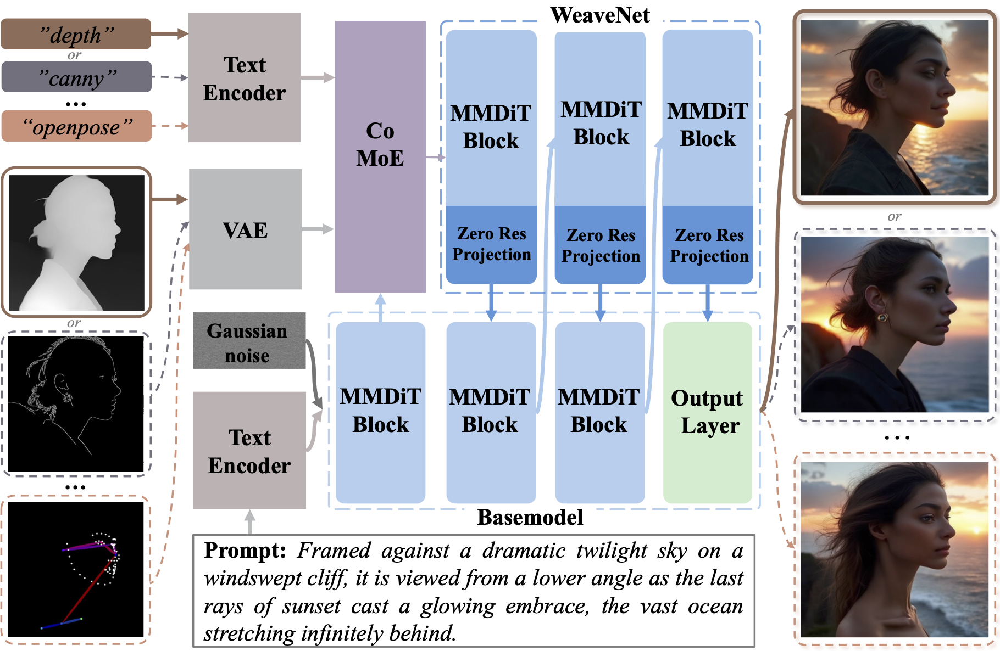

<h1 align="center"> <href src="https://arxiv.org/pdf/2508.17364">Condition Weaving Meets Expert Modulation: Towards Universal and Controllable Image Generation (UniGen) </h1>


> **[Condition Weaving Meets Expert Modulation: Towards Universal and Controllable Image Generation](https://arxiv.org/pdf/2508.17364)** \
> Guoqing Zhang <sup>1,3</sup>, Xingtong Ge<sup>2,3</sup>, Lu Shi <sup>1</sup>, Xin Zhang<sup>3</sup>, Muqing Xue<sup>1</sup>, Wanru Xu <sup>1</sup>, Yigang Cen <sup>1</sup> \
> <sup>1</sup> Bejing Jiaotong University <sup>2</sup> Hong Kong University of Science and Technology  <sup>3</sup> SenseTime Research \
> This work was done by Guoqing Zhang during internship at SenseTime Research Institute.




## ✅ TODO
- [x] **2025.08.20**: ***[UniGen](https://arxiv.org/pdf/2508.17364) paper uploaded to arXiv.***

- [ ] **2025.09.01**: ***upload UniGen inference code.*** 

- [x] **2025.09.05**: ***Upload checkpoints to [Hugging face](https://huggingface.co/gavin-zhang/UniGen).*** 

- [ ] ***Upload UniGen training code.*** 

## Instruction
### Environment Preparation
Setup the env first (need to wait a few minutes).
```
conda env create -f environment.yaml
conda activate unigen
```

### Checkpoint Preparation

```
Upload completed quickly
```

### Data Preparation 
- MultiGen-20M
    - Please download the training dataset ([MultiGen-20M](https://console.cloud.google.com/storage/browser/sfr-unicontrol-data-research/dataset)) to `./multigen20m`.
        ```
        cd multigen20m
        gsutil -m cp -r gs://sfr-unicontrol-data-research/dataset ./
        ```
    - Then unzip the all the files.
    - Download the training and test data split from the MultiGen-20M dataset: [Json](https://huggingface.co/datasets/gavin-zhang/MultiGen20M_json). All images were relabeled using [Qwen](https://huggingface.co/Qwen/Qwen-7B-Chat).
    
- Subjects 200K
    - Download the preprocessed Subjects-200K dataset from [huggingface](https://huggingface.co/datasets/gavin-zhang/Subjects200K).
    - Then unzip the all the files.

### Training model
```
Upload completed quickly
```

### Inference or Gradio demo
```
Upload completed quickly
```

### Results


## Citation
If you find this project useful for your research, please kindly cite our paper:

```bibtex
@article{zhang2025condition,
  title={Condition Weaving Meets Expert Modulation: Towards Universal and Controllable Image Generation},
  author={Zhang, Guoqing and Ge, Xingtong and Shi, Lu and Zhang, Xin and Xue, Muqing and Xu, Wanru and Cen, Yigang},
  journal={arXiv preprint arXiv:2508.17364},
  year={2025}
}
```

## Acknowledgement

**This project is built on [Stable Diffusion](https://github.com/CompVis/stable-diffusion), [ControlNet](https://github.com/lllyasviel/ControlNet), [Unicombine](https://github.com/Xuan-World/UniCombine) and [UniControl](https://github.com/salesforce/UniControl). We are very grateful for their open source and community contributions.**

    
